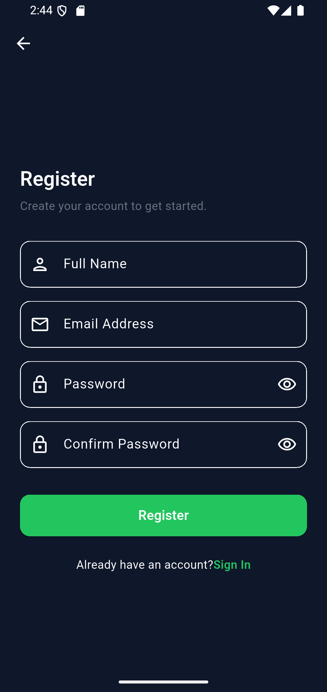
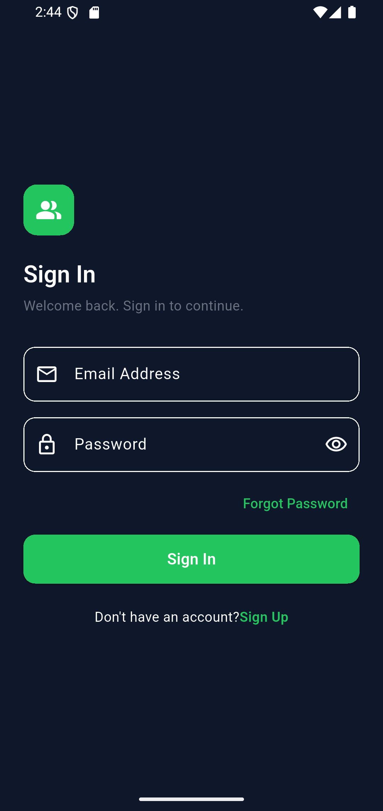
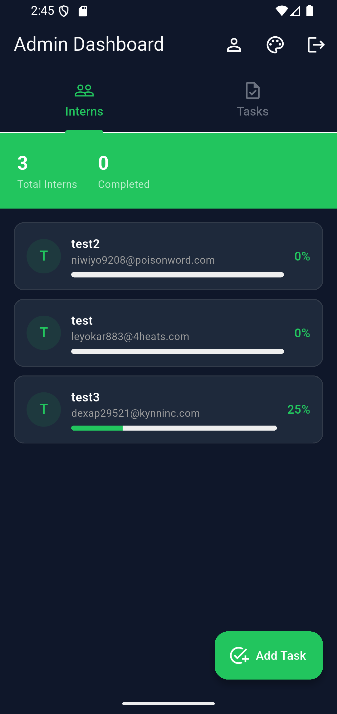
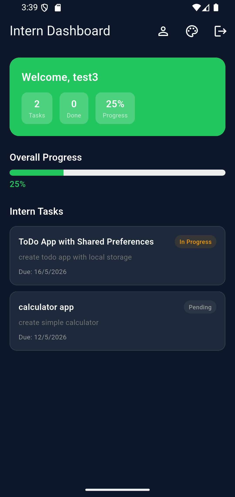
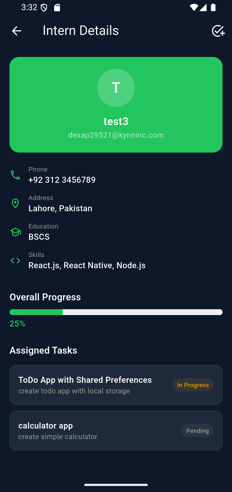
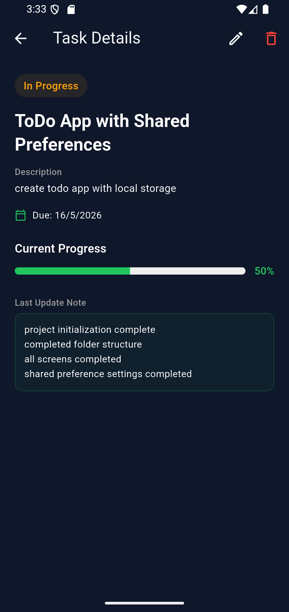

# Intern Management System

A full-stack Flutter application built as part of an active development portfolio. This app provides a centralized platform where admins can manage interns, assign tasks, and track progress - while interns can view their assignments and update their work status in real time.

---

## Features

**Admin**
- View all registered interns with real-time progress tracking
- Assign tasks to all interns or a specific intern individually
- Edit and delete tasks with group-level control
- View detailed intern profiles with task-wise breakdown
- Adaptive dashboard with live Firestore updates

**Intern**
- Secure login with email verification
- Complete profile setup after registration
- View assigned tasks and update progress with notes
- Real-time overall progress tracking

**Both**
- Role-based access - automatic routing after login
- Light, Dark, and System Default theme support
- Responsive layout - works on mobile, tablet, and web
- Edit profile with all details except email

---

## Tech Stack

| Layer | Technology |
|---|---|
| Framework | Flutter |
| Language | Dart |
| Authentication | Firebase Auth |
| Database | Cloud Firestore |
| State Management | Provider |
| Architecture | MVVM-inspired |
| Responsive | ResponsiveFramework |
| Local Storage | SharedPreferences |

---

## Project Structure

```
lib/
├── core/
│   ├── constants/        # Colors, strings, theme
│   └── utils/            # Responsive helper
├── models/               # InternModel, TaskModel
├── providers/            # AuthProvider, InternProvider, ThemeProvider
├── services/             # AuthService, FirestoreService
├── views/
│   ├── auth/             # Login, Register, Verify Email, Complete Profile, Forgot Password
│   ├── admin/            # Admin Dashboard, Intern Detail, Add Task
│   ├── intern/           # Intern Dashboard
│   └── shared/           # Task Detail, Edit Profile, Theme Settings
└── widgets/              # CustomLoader, ShimmerLoader
```

---

## Architecture

This project follows an **MVVM-inspired architecture** - separating UI, business logic, and data access into distinct layers.

- **Models** - define the data structure for interns and tasks
- **Services** - handle all Firebase operations (auth, Firestore CRUD)
- **Providers** - act as ViewModels, managing state and notifying the UI
- **Views** - screens that listen to providers and render UI

Real-time updates are handled through Firestore streams - any change made by admin reflects instantly on the intern's dashboard without manual refresh.

---

## Getting Started

**Prerequisites**
- Flutter SDK 3.x
- Firebase project with Auth and Firestore enabled

**Setup**

```bash
git clone https://github.com/MuhammadYousuf12/intern-management-system.git
cd intern-management-system
flutter pub get
flutter run
```

> Firebase configuration is included via `flutterfire configure`. To connect your own Firebase project, run `flutterfire configure` and replace `lib/firebase_options.dart`.

---

## Screenshots

| Sign Up | Sign In |
|---|---|
|  |  |

| Admin Dashboard | Intern Dashboard |
|---|---|
|  |  |

| Intern Detail | Task Detail |
|---|---|
|  |  |

---

## Author

**Muhammad Yousuf Sorathia**
Flutter Developer | Karachi, Pakistan

[LinkedIn](https://linkedin.com/in/muhammadyousufsorathia) · [GitHub](https://github.com/MuhammadYousuf12)

---

*Part of an active Flutter development portfolio*